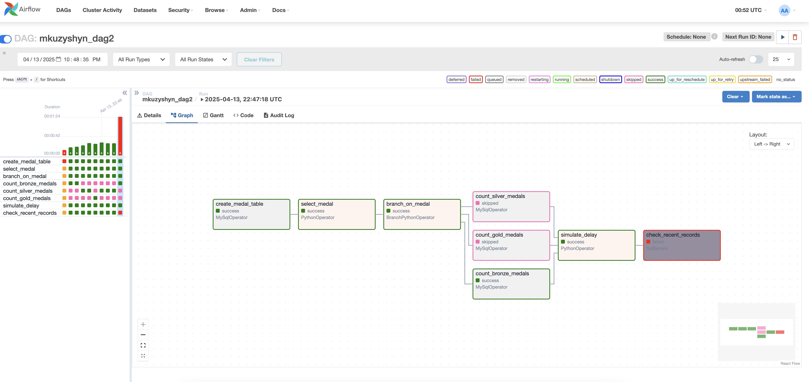
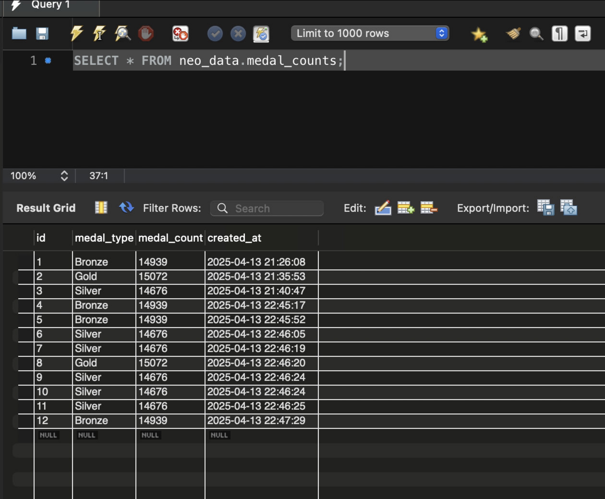

# goit-de-hw-07

# Домашнє завдання до теми “Apache Airflow”

Вітаю в домашньому завданні до теми «Apache Airflow»! 🙂

Ваше завдання сьогодні — **реалізувати DAG із використанням вивчених операторів,
щоб виконати певний перелік прикладних завдань.**

Це завдання допоможе вам закріпити знання з Apache Airflow для роботи з MySQL
базами даних, опанувати логіку розгалуження DAG, залежно від результатів
виконання попередніх завдань, закріпити вміння працювати із затримками виконання
завдань у DAG.

Воно також допоможе вам краще зрозуміти, як керувати процесами обробки даних в
Apache Airflow, і підготує до розв’язання більш складних сценаріїв роботи з
даними.

3. Створіть один архів, що містить весь код виконання завдання, та текстовий
   документ із скриншотами, прикріпіть його в LMS. Назва архіву повинна бути у
   форматі ДЗ7_ПІБ.

4. Прикріпіть посилання на репозиторій `goit-de-hw-07` і відправте на перевірку.

### Результат виконаного завдання № 1

### Результат виконаного завдання № 2

### Результат виконаного завдання № 3

